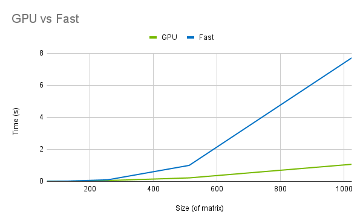

# MiniTorch Module 3


* Docs: https://minitorch.github.io/

* Overview: https://minitorch.github.io/module3.html


You will need to modify `tensor_functions.py` slightly in this assignment.

* Tests:

```
python run_tests.py
```

* Note:

Several of the tests for this assignment will only run if you are on a GPU machine and will not
run on github's test infrastructure. Please follow the instructions to setup up a colab machine
to run these tests.

This assignment requires the following files from the previous assignments. You can get these by running

```bash
python sync_previous_module.py previous-module-dir current-module-dir
```

The files that will be synced are:

        minitorch/tensor_data.py minitorch/tensor_functions.py minitorch/tensor_ops.py minitorch/operators.py minitorch/scalar.py minitorch/scalar_functions.py minitorch/module.py minitorch/autodiff.py minitorch/module.py project/run_manual.py project/run_scalar.py project/run_tensor.py minitorch/operators.py minitorch/module.py minitorch/autodiff.py minitorch/tensor.py minitorch/datasets.py minitorch/testing.py minitorch/optim.py

## Performance Comparison: GPU vs Fast

The following graph illustrates the speed-ups on large matrix operations that CUDA matrix multiplication has over naive operations.



## Training times

### Simple Dataset w/ Hidden Size 100

Click below for the CPU and GPU times.

<details>
<summary>CPU</summary>
Epoch   0 | loss 7.129110 | correct 43 | Time/epoch 21.874s<br>
Epoch  10 | loss 2.946556 | correct 48 | Time/epoch 0.099s<br>
Epoch  20 | loss 1.897210 | correct 49 | Time/epoch 0.104s<br>
Epoch  30 | loss 2.321437 | correct 49 | Time/epoch 0.101s<br>
Epoch  40 | loss 0.458984 | correct 49 | Time/epoch 0.099s<br>
Epoch  50 | loss 0.310600 | correct 49 | Time/epoch 0.173s<br>
Epoch  60 | loss 1.266586 | correct 50 | Time/epoch 0.099s<br>
Epoch  70 | loss 0.897634 | correct 49 | Time/epoch 0.098s<br>
Epoch  80 | loss 0.249812 | correct 49 | Time/epoch 0.095s<br>
Epoch  90 | loss 0.018999 | correct 50 | Time/epoch 0.096s<br>
Epoch 100 | loss 0.785954 | correct 50 | Time/epoch 0.096s<br>
Epoch 110 | loss 0.445344 | correct 50 | Time/epoch 0.096s<br>
Epoch 120 | loss 0.029815 | correct 50 | Time/epoch 0.095s<br>
Epoch 130 | loss 1.407645 | correct 50 | Time/epoch 0.109s<br>
Epoch 140 | loss 0.729497 | correct 50 | Time/epoch 0.102s<br>
Epoch 150 | loss 0.092497 | correct 50 | Time/epoch 0.099s<br>
Epoch 160 | loss 0.704759 | correct 50 | Time/epoch 0.096s<br>
Epoch 170 | loss 0.332510 | correct 49 | Time/epoch 0.221s<br>
Epoch 180 | loss 0.488567 | correct 50 | Time/epoch 0.097s<br>
Epoch 190 | loss 0.005283 | correct 50 | Time/epoch 0.097s<br>
Epoch 200 | loss 0.822763 | correct 50 | Time/epoch 0.101s<br>
Epoch 210 | loss 0.337094 | correct 49 | Time/epoch 0.098s<br>
Epoch 220 | loss 0.145768 | correct 50 | Time/epoch 0.099s<br>
Epoch 230 | loss 0.111058 | correct 50 | Time/epoch 0.109s<br>
Epoch 240 | loss 0.245131 | correct 50 | Time/epoch 0.097s<br>
Epoch 250 | loss 0.008469 | correct 50 | Time/epoch 0.096s<br>
Epoch 260 | loss 0.261438 | correct 50 | Time/epoch 0.097s<br>
Epoch 270 | loss 0.978733 | correct 50 | Time/epoch 0.096s<br>
Epoch 280 | loss 0.006038 | correct 49 | Time/epoch 0.098s<br>
Epoch 290 | loss 0.126511 | correct 50 | Time/epoch 0.228s<br>
Epoch 300 | loss 0.561839 | correct 50 | Time/epoch 0.098s<br>
Epoch 310 | loss 0.498986 | correct 50 | Time/epoch 0.098s<br>
Epoch 320 | loss 0.009375 | correct 50 | Time/epoch 0.096s<br>
Epoch 330 | loss 0.008794 | correct 50 | Time/epoch 0.105s<br>
Epoch 340 | loss 0.276903 | correct 50 | Time/epoch 0.099s<br>
Epoch 350 | loss 0.450139 | correct 50 | Time/epoch 0.097s<br>
Epoch 360 | loss 0.592408 | correct 50 | Time/epoch 0.097s<br>
Epoch 370 | loss 0.569468 | correct 50 | Time/epoch 0.096s<br>
Epoch 380 | loss 0.708758 | correct 50 | Time/epoch 0.095s<br>
Epoch 390 | loss 0.707219 | correct 50 | Time/epoch 0.116s<br>
Epoch 400 | loss 0.634800 | correct 50 | Time/epoch 0.097s<br>
Epoch 410 | loss 0.123268 | correct 50 | Time/epoch 0.223s<br>
Epoch 420 | loss 0.916432 | correct 50 | Time/epoch 0.225s<br>
Epoch 430 | loss 0.000077 | correct 50 | Time/epoch 0.110s<br>
Epoch 440 | loss 0.059406 | correct 50 | Time/epoch 0.100s<br>
Epoch 450 | loss 0.333143 | correct 50 | Time/epoch 0.096s<br>
Epoch 460 | loss 0.160591 | correct 50 | Time/epoch 0.096s<br>
Epoch 470 | loss 0.001260 | correct 50 | Time/epoch 0.097s<br>
Epoch 480 | loss 0.253075 | correct 50 | Time/epoch 0.099s<br>
Epoch 490 | loss 0.276514 | correct 50 | Time/epoch 0.096s<br>
</details>

<details>
<summary>GPU</summary>
Epoch   0 | loss 5.157476 | correct 46 | Time/epoch 4.484s<br>
Epoch  10 | loss 1.250286 | correct 48 | Time/epoch 1.376s<br>
Epoch  20 | loss 1.285082 | correct 49 | Time/epoch 1.405s<br>
Epoch  30 | loss 0.522122 | correct 49 | Time/epoch 1.400s<br>
Epoch  40 | loss 0.725272 | correct 50 | Time/epoch 1.383s<br>
Epoch  50 | loss 0.262390 | correct 49 | Time/epoch 1.841s<br>
Epoch  60 | loss 0.403588 | correct 50 | Time/epoch 1.372s<br>
Epoch  70 | loss 1.018233 | correct 49 | Time/epoch 1.378s<br>
Epoch  80 | loss 0.561936 | correct 50 | Time/epoch 1.380s<br>
Epoch  90 | loss 0.601933 | correct 49 | Time/epoch 1.399s<br>
Epoch 100 | loss 0.421189 | correct 50 | Time/epoch 1.718s<br>
Epoch 110 | loss 0.582415 | correct 49 | Time/epoch 1.456s<br>
Epoch 120 | loss 1.639665 | correct 49 | Time/epoch 1.385s<br>
Epoch 130 | loss 0.105992 | correct 49 | Time/epoch 1.390s<br>
Epoch 140 | loss 0.269902 | correct 49 | Time/epoch 1.373s<br>
Epoch 150 | loss 0.101179 | correct 49 | Time/epoch 1.373s<br>
Epoch 160 | loss 0.938684 | correct 49 | Time/epoch 2.012s<br>
Epoch 170 | loss 0.123711 | correct 50 | Time/epoch 1.385s<br>
Epoch 180 | loss 0.020657 | correct 50 | Time/epoch 1.374s<br>
Epoch 190 | loss 0.017975 | correct 49 | Time/epoch 1.362s<br>
Epoch 200 | loss 1.527343 | correct 49 | Time/epoch 1.402s<br>
Epoch 210 | loss 0.303688 | correct 49 | Time/epoch 1.878s<br>
Epoch 220 | loss 0.092926 | correct 49 | Time/epoch 1.370s<br>
Epoch 230 | loss 0.028534 | correct 49 | Time/epoch 1.377s<br>
Epoch 240 | loss 0.211879 | correct 50 | Time/epoch 1.374s<br>
Epoch 250 | loss 1.598304 | correct 49 | Time/epoch 1.365s<br>
Epoch 260 | loss 0.037128 | correct 50 | Time/epoch 1.360s<br>
Epoch 270 | loss 0.122906 | correct 49 | Time/epoch 2.052s<br>
Epoch 280 | loss 0.106173 | correct 49 | Time/epoch 1.371s<br>
Epoch 290 | loss 1.020686 | correct 50 | Time/epoch 1.365s<br>
Epoch 300 | loss 0.061129 | correct 50 | Time/epoch 1.386s<br>
Epoch 310 | loss 0.553587 | correct 50 | Time/epoch 1.367s<br>
Epoch 320 | loss 0.025663 | correct 50 | Time/epoch 1.366s<br>
Epoch 330 | loss 0.305075 | correct 50 | Time/epoch 2.015s<br>
Epoch 340 | loss 0.036088 | correct 50 | Time/epoch 1.414s<br>
Epoch 350 | loss 0.020005 | correct 50 | Time/epoch 1.434s<br>
Epoch 360 | loss 0.047750 | correct 49 | Time/epoch 1.362s<br>
Epoch 370 | loss 0.024887 | correct 50 | Time/epoch 1.436s<br>
Epoch 380 | loss 0.436363 | correct 49 | Time/epoch 1.776s<br>
Epoch 390 | loss 0.024866 | correct 50 | Time/epoch 1.596s<br>
Epoch 400 | loss 0.154126 | correct 49 | Time/epoch 1.443s<br>
Epoch 410 | loss 0.010351 | correct 49 | Time/epoch 1.426s<br>
Epoch 420 | loss 0.392520 | correct 50 | Time/epoch 1.445s<br>
Epoch 430 | loss 0.957785 | correct 50 | Time/epoch 1.423s<br>
Epoch 440 | loss 0.134028 | correct 49 | Time/epoch 1.979s<br>
Epoch 450 | loss 0.009593 | correct 50 | Time/epoch 1.434s<br>
Epoch 460 | loss 0.699601 | correct 49 | Time/epoch 1.424s<br>
Epoch 470 | loss 0.711810 | correct 49 | Time/epoch 1.436s<br>
Epoch 480 | loss 1.030740 | correct 50 | Time/epoch 1.454s<br>
Epoch 490 | loss 0.205119 | correct 50 | Time/epoch 1.430s<br>
</details>

### Split Dataset w/ Hidden Size 100

Click below for the CPU and GPU times.

<details>
<summary>CPU</summary>
Epoch   0 | loss 5.513937 | correct 36 | Time/epoch 21.815s<br>
Epoch  10 | loss 4.211195 | correct 41 | Time/epoch 0.097s<br>
Epoch  20 | loss 3.511429 | correct 39 | Time/epoch 0.097s<br>
Epoch  30 | loss 3.301197 | correct 46 | Time/epoch 0.096s<br>
Epoch  40 | loss 0.660914 | correct 34 | Time/epoch 0.095s<br>
Epoch  50 | loss 1.865769 | correct 48 | Time/epoch 0.095s<br>
Epoch  60 | loss 2.660754 | correct 48 | Time/epoch 0.097s<br>
Epoch  70 | loss 3.504392 | correct 47 | Time/epoch 0.096s<br>
Epoch  80 | loss 2.096482 | correct 46 | Time/epoch 0.106s<br>
Epoch  90 | loss 0.794168 | correct 48 | Time/epoch 0.096s<br>
Epoch 100 | loss 3.066883 | correct 48 | Time/epoch 0.095s<br>
Epoch 110 | loss 1.679946 | correct 45 | Time/epoch 0.147s<br>
Epoch 120 | loss 2.430616 | correct 46 | Time/epoch 0.184s<br>
Epoch 130 | loss 1.929402 | correct 50 | Time/epoch 0.095s<br>
Epoch 140 | loss 1.217379 | correct 50 | Time/epoch 0.095s<br>
Epoch 150 | loss 1.196383 | correct 49 | Time/epoch 0.095s<br>
Epoch 160 | loss 1.352175 | correct 50 | Time/epoch 0.096s<br>
Epoch 170 | loss 2.091854 | correct 46 | Time/epoch 0.095s<br>
Epoch 180 | loss 1.072992 | correct 50 | Time/epoch 0.095s<br>
Epoch 190 | loss 1.029824 | correct 50 | Time/epoch 0.094s<br>
Epoch 200 | loss 0.615876 | correct 49 | Time/epoch 0.095s<br>
Epoch 210 | loss 1.028453 | correct 50 | Time/epoch 0.098s<br>
Epoch 220 | loss 1.207640 | correct 50 | Time/epoch 0.095s<br>
Epoch 230 | loss 0.461682 | correct 50 | Time/epoch 0.095s<br>
Epoch 240 | loss 1.264002 | correct 50 | Time/epoch 0.131s<br>
Epoch 250 | loss 0.634347 | correct 50 | Time/epoch 0.094s<br>
Epoch 260 | loss 0.277020 | correct 50 | Time/epoch 0.107s<br>
Epoch 270 | loss 1.721210 | correct 45 | Time/epoch 0.098s<br>
Epoch 280 | loss 1.586376 | correct 48 | Time/epoch 0.095s<br>
Epoch 290 | loss 0.191044 | correct 50 | Time/epoch 0.094s<br>
Epoch 300 | loss 1.263995 | correct 49 | Time/epoch 0.095s<br>
Epoch 310 | loss 0.205815 | correct 50 | Time/epoch 0.095s<br>
Epoch 320 | loss 0.536306 | correct 50 | Time/epoch 0.096s<br>
Epoch 330 | loss 0.874386 | correct 50 | Time/epoch 0.095s<br>
Epoch 340 | loss 0.929821 | correct 50 | Time/epoch 0.104s<br>
Epoch 350 | loss 0.331829 | correct 50 | Time/epoch 0.094s<br>
Epoch 360 | loss 0.743873 | correct 50 | Time/epoch 0.148s<br>
Epoch 370 | loss 0.033729 | correct 49 | Time/epoch 0.164s<br>
Epoch 380 | loss 0.313251 | correct 50 | Time/epoch 0.094s<br>
Epoch 390 | loss 0.194911 | correct 50 | Time/epoch 0.097s<br>
Epoch 400 | loss 0.206180 | correct 50 | Time/epoch 0.094s<br>
Epoch 410 | loss 0.615259 | correct 50 | Time/epoch 0.095s<br>
Epoch 420 | loss 0.041167 | correct 50 | Time/epoch 0.095s<br>
Epoch 430 | loss 0.302820 | correct 50 | Time/epoch 0.107s<br>
Epoch 440 | loss 0.227690 | correct 50 | Time/epoch 0.094s<br>
Epoch 450 | loss 0.348787 | correct 50 | Time/epoch 0.094s<br>
Epoch 460 | loss 0.294791 | correct 50 | Time/epoch 0.094s<br>
Epoch 470 | loss 0.245370 | correct 50 | Time/epoch 0.098s<br>
Epoch 480 | loss 0.256506 | correct 50 | Time/epoch 0.095s<br>
Epoch 490 | loss 0.363866 | correct 50 | Time/epoch 0.213s<br>
</details>

<details>
<summary>GPU</summary>
Epoch   0 | loss 6.360098 | correct 28 | Time/epoch 5.434s<br>
Epoch  10 | loss 5.562011 | correct 39 | Time/epoch 1.387s<br>
Epoch  20 | loss 6.310424 | correct 37 | Time/epoch 1.396s<br>
Epoch  30 | loss 4.915457 | correct 45 | Time/epoch 1.395s<br>
Epoch  40 | loss 3.011965 | correct 45 | Time/epoch 1.704s<br>
Epoch  50 | loss 3.513882 | correct 46 | Time/epoch 1.423s<br>
Epoch  60 | loss 2.493221 | correct 47 | Time/epoch 1.400s<br>
Epoch  70 | loss 1.650403 | correct 47 | Time/epoch 1.393s<br>
Epoch  80 | loss 2.706538 | correct 46 | Time/epoch 1.383s<br>
Epoch  90 | loss 2.473138 | correct 48 | Time/epoch 1.502s<br>
Epoch 100 | loss 1.113997 | correct 49 | Time/epoch 1.690s<br>
Epoch 110 | loss 2.056636 | correct 49 | Time/epoch 1.394s<br>
Epoch 120 | loss 1.235082 | correct 49 | Time/epoch 1.392s<br>
Epoch 130 | loss 2.180583 | correct 48 | Time/epoch 1.396s<br>
Epoch 140 | loss 1.861788 | correct 48 | Time/epoch 1.601s<br>
Epoch 150 | loss 0.697359 | correct 48 | Time/epoch 1.589s<br>
Epoch 160 | loss 0.508582 | correct 49 | Time/epoch 1.382s<br>
Epoch 170 | loss 1.546126 | correct 50 | Time/epoch 1.402s<br>
Epoch 180 | loss 0.710645 | correct 49 | Time/epoch 1.389s<br>
Epoch 190 | loss 2.128681 | correct 48 | Time/epoch 1.393s<br>
Epoch 200 | loss 1.128437 | correct 49 | Time/epoch 1.930s<br>
Epoch 210 | loss 0.784599 | correct 49 | Time/epoch 1.386s<br>
Epoch 220 | loss 0.082554 | correct 49 | Time/epoch 1.415s<br>
Epoch 230 | loss 1.076027 | correct 50 | Time/epoch 1.386s<br>
Epoch 240 | loss 1.637862 | correct 48 | Time/epoch 1.381s<br>
Epoch 250 | loss 2.266303 | correct 50 | Time/epoch 1.939s<br>
Epoch 260 | loss 0.397726 | correct 49 | Time/epoch 1.405s<br>
Epoch 270 | loss 0.491331 | correct 49 | Time/epoch 1.409s<br>
Epoch 280 | loss 0.738094 | correct 50 | Time/epoch 1.992s<br>
Epoch 290 | loss 0.487938 | correct 50 | Time/epoch 1.377s<br>
Epoch 300 | loss 1.193812 | correct 49 | Time/epoch 2.049s<br>
Epoch 310 | loss 1.200962 | correct 50 | Time/epoch 1.376s<br>
Epoch 320 | loss 0.316224 | correct 49 | Time/epoch 1.378s<br>
Epoch 330 | loss 0.302942 | correct 49 | Time/epoch 1.388s<br>
Epoch 340 | loss 0.501311 | correct 50 | Time/epoch 1.383s<br>
Epoch 350 | loss 0.627615 | correct 50 | Time/epoch 1.728s<br>
Epoch 360 | loss 1.266220 | correct 50 | Time/epoch 1.503s<br>
Epoch 370 | loss 0.702427 | correct 49 | Time/epoch 1.451s<br>
Epoch 380 | loss 0.984904 | correct 49 | Time/epoch 1.457s<br>
Epoch 390 | loss 1.331533 | correct 50 | Time/epoch 1.460s<br>
Epoch 400 | loss 0.263109 | correct 49 | Time/epoch 1.451s<br>
Epoch 410 | loss 0.132350 | correct 50 | Time/epoch 1.891s<br>
Epoch 420 | loss 0.315379 | correct 50 | Time/epoch 1.473s<br>
Epoch 430 | loss 0.865725 | correct 50 | Time/epoch 1.448s<br>
Epoch 440 | loss 0.253330 | correct 49 | Time/epoch 1.450s<br>
Epoch 450 | loss 0.036919 | correct 49 | Time/epoch 1.510s<br>
Epoch 460 | loss 0.557020 | correct 49 | Time/epoch 1.849s<br>
Epoch 470 | loss 0.792600 | correct 50 | Time/epoch 1.446s<br>
Epoch 480 | loss 0.848296 | correct 49 | Time/epoch 1.449s<br>
Epoch 490 | loss 0.019554 | correct 49 | Time/epoch 1.447s<br>
</details>

### Xor Dataset w/ Hidden Size 100

Click below for the CPU and GPU times.

<details>
<summary>CPU</summary>
Epoch   0 | loss 6.989429 | correct 35 | Time/epoch 22.567s<br>
Epoch  10 | loss 4.419775 | correct 39 | Time/epoch 0.097s<br>
Epoch  20 | loss 5.291611 | correct 30 | Time/epoch 0.096s<br>
Epoch  30 | loss 4.879875 | correct 43 | Time/epoch 0.097s<br>
Epoch  40 | loss 2.756352 | correct 40 | Time/epoch 0.095s<br>
Epoch  50 | loss 3.668334 | correct 45 | Time/epoch 0.095s<br>
Epoch  60 | loss 2.297226 | correct 44 | Time/epoch 0.096s<br>
Epoch  70 | loss 1.767787 | correct 44 | Time/epoch 0.095s<br>
Epoch  80 | loss 2.001317 | correct 41 | Time/epoch 0.105s<br>
Epoch  90 | loss 2.704660 | correct 44 | Time/epoch 0.223s<br>
Epoch 100 | loss 2.632775 | correct 44 | Time/epoch 0.099s<br>
Epoch 110 | loss 1.404419 | correct 42 | Time/epoch 0.094s<br>
Epoch 120 | loss 3.343232 | correct 47 | Time/epoch 0.095s<br>
Epoch 130 | loss 4.177197 | correct 47 | Time/epoch 0.100s<br>
Epoch 140 | loss 1.797376 | correct 44 | Time/epoch 0.094s<br>
Epoch 150 | loss 1.874053 | correct 46 | Time/epoch 0.096s<br>
Epoch 160 | loss 3.950594 | correct 46 | Time/epoch 0.096s<br>
Epoch 170 | loss 2.700998 | correct 47 | Time/epoch 0.103s<br>
Epoch 180 | loss 2.938390 | correct 47 | Time/epoch 0.095s<br>
Epoch 190 | loss 2.659980 | correct 49 | Time/epoch 0.094s<br>
Epoch 200 | loss 1.657192 | correct 48 | Time/epoch 0.098s<br>
Epoch 210 | loss 3.312342 | correct 46 | Time/epoch 0.206s<br>
Epoch 220 | loss 0.427082 | correct 49 | Time/epoch 0.202s<br>
Epoch 230 | loss 2.024345 | correct 48 | Time/epoch 0.096s<br>
Epoch 240 | loss 2.388746 | correct 46 | Time/epoch 0.093s<br>
Epoch 250 | loss 1.521635 | correct 50 | Time/epoch 0.099s<br>
Epoch 260 | loss 2.426881 | correct 49 | Time/epoch 0.098s<br>
Epoch 270 | loss 1.811882 | correct 46 | Time/epoch 0.096s<br>
Epoch 280 | loss 2.063189 | correct 46 | Time/epoch 0.095s<br>
Epoch 290 | loss 2.525989 | correct 49 | Time/epoch 0.095s<br>
Epoch 300 | loss 0.823767 | correct 48 | Time/epoch 0.095s<br>
Epoch 310 | loss 1.376700 | correct 48 | Time/epoch 0.097s<br>
Epoch 320 | loss 1.632284 | correct 50 | Time/epoch 0.109s<br>
Epoch 330 | loss 0.886388 | correct 47 | Time/epoch 0.125s<br>
Epoch 340 | loss 2.573094 | correct 48 | Time/epoch 0.166s<br>
Epoch 350 | loss 1.680014 | correct 47 | Time/epoch 0.098s<br>
Epoch 360 | loss 0.195722 | correct 48 | Time/epoch 0.095s<br>
Epoch 370 | loss 1.406788 | correct 50 | Time/epoch 0.093s<br>
Epoch 380 | loss 0.905251 | correct 48 | Time/epoch 0.095s<br>
Epoch 390 | loss 1.289510 | correct 50 | Time/epoch 0.094s<br>
Epoch 400 | loss 0.368548 | correct 50 | Time/epoch 0.094s<br>
Epoch 410 | loss 1.247916 | correct 49 | Time/epoch 0.093s<br>
Epoch 420 | loss 0.703238 | correct 50 | Time/epoch 0.092s<br>
Epoch 430 | loss 1.820171 | correct 50 | Time/epoch 0.107s<br>
Epoch 440 | loss 1.097772 | correct 49 | Time/epoch 0.095s<br>
Epoch 450 | loss 0.314847 | correct 49 | Time/epoch 0.094s<br>
Epoch 460 | loss 0.316897 | correct 46 | Time/epoch 0.222s<br>
Epoch 470 | loss 0.759163 | correct 50 | Time/epoch 0.094s<br>
Epoch 480 | loss 1.272834 | correct 48 | Time/epoch 0.095s<br>
Epoch 490 | loss 0.091108 | correct 50 | Time/epoch 0.097s<br>
</details>

<details>
<summary>GPU</summary>
Epoch   0 | loss 6.680731 | correct 39 | Time/epoch 3.699s<br>
Epoch  10 | loss 7.024702 | correct 36 | Time/epoch 1.700s<br>
Epoch  20 | loss 3.926007 | correct 44 | Time/epoch 1.459s<br>
Epoch  30 | loss 2.053320 | correct 44 | Time/epoch 1.388s<br>
Epoch  40 | loss 2.461631 | correct 45 | Time/epoch 1.377s<br>
Epoch  50 | loss 2.040430 | correct 45 | Time/epoch 1.371s<br>
Epoch  60 | loss 3.025786 | correct 48 | Time/epoch 1.375s<br>
Epoch  70 | loss 3.245090 | correct 47 | Time/epoch 2.078s<br>
Epoch  80 | loss 1.412747 | correct 47 | Time/epoch 1.377s<br>
Epoch  90 | loss 3.420426 | correct 46 | Time/epoch 1.378s<br>
Epoch 100 | loss 3.167101 | correct 46 | Time/epoch 1.374s<br>
Epoch 110 | loss 2.730364 | correct 50 | Time/epoch 1.380s<br>
Epoch 120 | loss 0.554058 | correct 48 | Time/epoch 1.864s<br>
Epoch 130 | loss 0.934442 | correct 49 | Time/epoch 1.962s<br>
Epoch 140 | loss 0.893338 | correct 48 | Time/epoch 1.385s<br>
Epoch 150 | loss 1.448982 | correct 49 | Time/epoch 1.389s<br>
Epoch 160 | loss 0.867327 | correct 48 | Time/epoch 1.384s<br>
Epoch 170 | loss 0.688761 | correct 50 | Time/epoch 1.419s<br>
Epoch 180 | loss 0.518432 | correct 50 | Time/epoch 1.745s<br>
Epoch 190 | loss 1.563353 | correct 50 | Time/epoch 1.472s<br>
Epoch 200 | loss 0.411712 | correct 50 | Time/epoch 1.371s<br>
Epoch 210 | loss 1.125175 | correct 50 | Time/epoch 1.376s<br>
Epoch 220 | loss 1.424902 | correct 49 | Time/epoch 1.397s<br>
Epoch 230 | loss 1.314489 | correct 50 | Time/epoch 1.370s<br>
Epoch 240 | loss 0.521280 | correct 50 | Time/epoch 2.074s<br>
Epoch 250 | loss 0.405755 | correct 50 | Time/epoch 1.379s<br>
Epoch 260 | loss 0.841511 | correct 50 | Time/epoch 1.375s<br>
Epoch 270 | loss 0.492504 | correct 50 | Time/epoch 1.366s<br>
Epoch 280 | loss 0.492320 | correct 50 | Time/epoch 1.371s<br>
Epoch 290 | loss 0.349173 | correct 50 | Time/epoch 1.447s<br>
Epoch 300 | loss 0.382907 | correct 50 | Time/epoch 1.892s<br>
Epoch 310 | loss 0.132532 | correct 50 | Time/epoch 1.397s<br>
Epoch 320 | loss 0.467751 | correct 50 | Time/epoch 1.366s<br>
Epoch 330 | loss 0.871517 | correct 50 | Time/epoch 1.374s<br>
Epoch 340 | loss 0.337663 | correct 50 | Time/epoch 1.376s<br>
Epoch 350 | loss 0.356885 | correct 50 | Time/epoch 1.679s<br>
Epoch 360 | loss 0.662623 | correct 50 | Time/epoch 1.639s<br>
Epoch 370 | loss 0.564685 | correct 50 | Time/epoch 1.448s<br>
Epoch 380 | loss 0.010170 | correct 50 | Time/epoch 1.428s<br>
Epoch 390 | loss 0.376054 | correct 50 | Time/epoch 1.428s<br>
Epoch 400 | loss 0.973567 | correct 50 | Time/epoch 1.452s<br>
Epoch 410 | loss 1.277117 | correct 50 | Time/epoch 1.934s<br>
Epoch 420 | loss 0.769803 | correct 50 | Time/epoch 1.461s<br>
Epoch 430 | loss 0.333979 | correct 50 | Time/epoch 1.450s<br>
Epoch 440 | loss 0.367400 | correct 50 | Time/epoch 1.449s<br>
Epoch 450 | loss 0.340784 | correct 50 | Time/epoch 1.438s<br>
Epoch 460 | loss 0.433471 | correct 50 | Time/epoch 1.432s<br>
Epoch 470 | loss 0.932333 | correct 50 | Time/epoch 1.599s<br>
Epoch 480 | loss 0.336462 | correct 50 | Time/epoch 1.447s<br>
Epoch 490 | loss 0.622957 | correct 50 | Time/epoch 1.451s<br>
</details>

### Simple Dataset w/ Hidden Size 200

Click below for the CPU and GPU times.

<details>
<summary>CPU</summary>
Epoch   0 | loss 2.429696 | correct 46 | Time/epoch 22.045s<br>
Epoch  10 | loss 0.185886 | correct 46 | Time/epoch 0.213s<br>
Epoch  20 | loss 0.414651 | correct 50 | Time/epoch 0.201s<br>
Epoch  30 | loss 0.183944 | correct 48 | Time/epoch 0.199s<br>
Epoch  40 | loss 0.775515 | correct 50 | Time/epoch 0.200s<br>
Epoch  50 | loss 0.178576 | correct 49 | Time/epoch 0.216s<br>
Epoch  60 | loss 0.574750 | correct 49 | Time/epoch 0.200s<br>
Epoch  70 | loss 1.065777 | correct 50 | Time/epoch 0.197s<br>
Epoch  80 | loss 0.762558 | correct 50 | Time/epoch 0.198s<br>
Epoch  90 | loss 0.586080 | correct 49 | Time/epoch 0.211s<br>
Epoch 100 | loss 0.788177 | correct 50 | Time/epoch 0.235s<br>
Epoch 110 | loss 0.149113 | correct 50 | Time/epoch 0.395s<br>
Epoch 120 | loss 0.137564 | correct 50 | Time/epoch 0.215s<br>
Epoch 130 | loss 0.186876 | correct 50 | Time/epoch 0.200s<br>
Epoch 140 | loss 0.490379 | correct 50 | Time/epoch 0.204s<br>
Epoch 150 | loss 0.203294 | correct 49 | Time/epoch 0.203s<br>
Epoch 160 | loss 0.721665 | correct 49 | Time/epoch 0.199s<br>
Epoch 170 | loss 0.889065 | correct 49 | Time/epoch 0.423s<br>
Epoch 180 | loss 0.242801 | correct 50 | Time/epoch 0.215s<br>
Epoch 190 | loss 0.168779 | correct 50 | Time/epoch 0.199s<br>
Epoch 200 | loss 0.395330 | correct 50 | Time/epoch 0.203s<br>
Epoch 210 | loss 0.083018 | correct 50 | Time/epoch 0.201s<br>
Epoch 220 | loss 0.694936 | correct 50 | Time/epoch 0.212s<br>
Epoch 230 | loss 0.618135 | correct 50 | Time/epoch 0.422s<br>
Epoch 240 | loss 0.552735 | correct 50 | Time/epoch 0.210s<br>
Epoch 250 | loss 0.030040 | correct 50 | Time/epoch 0.214s<br>
Epoch 260 | loss 0.118269 | correct 50 | Time/epoch 0.213s<br>
Epoch 270 | loss 0.000252 | correct 50 | Time/epoch 0.202s<br>
Epoch 280 | loss 0.150835 | correct 50 | Time/epoch 0.199s<br>
Epoch 290 | loss 0.153914 | correct 50 | Time/epoch 0.411s<br>
Epoch 300 | loss 0.218061 | correct 50 | Time/epoch 0.202s<br>
Epoch 310 | loss 0.093723 | correct 50 | Time/epoch 0.412s<br>
Epoch 320 | loss 0.034606 | correct 50 | Time/epoch 0.203s<br>
Epoch 330 | loss 0.001115 | correct 50 | Time/epoch 0.201s<br>
Epoch 340 | loss 0.073801 | correct 50 | Time/epoch 0.410s<br>
Epoch 350 | loss 0.498645 | correct 50 | Time/epoch 0.201s<br>
Epoch 360 | loss 0.128710 | correct 50 | Time/epoch 0.204s<br>
Epoch 370 | loss 0.537009 | correct 50 | Time/epoch 0.200s<br>
Epoch 380 | loss 0.000198 | correct 50 | Time/epoch 0.204s<br>
Epoch 390 | loss 0.029593 | correct 50 | Time/epoch 0.198s<br>
Epoch 400 | loss 0.019165 | correct 50 | Time/epoch 0.390s<br>
Epoch 410 | loss 0.024111 | correct 50 | Time/epoch 0.199s<br>
Epoch 420 | loss 0.261596 | correct 50 | Time/epoch 0.211s<br>
Epoch 430 | loss 0.094617 | correct 50 | Time/epoch 0.199s<br>
Epoch 440 | loss 0.186549 | correct 50 | Time/epoch 0.203s<br>
Epoch 450 | loss 0.031676 | correct 50 | Time/epoch 0.199s<br>
Epoch 460 | loss 0.055259 | correct 50 | Time/epoch 0.323s<br>
Epoch 470 | loss 0.040151 | correct 50 | Time/epoch 0.201s<br>
Epoch 480 | loss 0.427609 | correct 50 | Time/epoch 0.199s<br>
Epoch 490 | loss 0.018976 | correct 50 | Time/epoch 0.210s<br>
</details>

<details>
<summary>GPU</summary>
Epoch   0 | loss 20.541653 | correct 24 | Time/epoch 5.554s<br>
Epoch  10 | loss 0.560356 | correct 48 | Time/epoch 1.441s<br>
Epoch  20 | loss 3.618383 | correct 47 | Time/epoch 1.457s<br>
Epoch  30 | loss 1.023151 | correct 48 | Time/epoch 1.975s<br>
Epoch  40 | loss 2.358464 | correct 49 | Time/epoch 1.441s<br>
Epoch  50 | loss 1.879471 | correct 44 | Time/epoch 1.467s<br>
Epoch  60 | loss 1.405724 | correct 49 | Time/epoch 1.440s<br>
Epoch  70 | loss 1.140570 | correct 50 | Time/epoch 1.708s<br>
Epoch  80 | loss 1.073295 | correct 48 | Time/epoch 1.451s<br>
Epoch  90 | loss 1.315947 | correct 50 | Time/epoch 1.451s<br>
Epoch 100 | loss 0.637334 | correct 48 | Time/epoch 1.437s<br>
Epoch 110 | loss 0.882027 | correct 50 | Time/epoch 1.474s<br>
Epoch 120 | loss 0.445799 | correct 50 | Time/epoch 1.591s<br>
Epoch 130 | loss 0.162069 | correct 50 | Time/epoch 1.441s<br>
Epoch 140 | loss 0.526740 | correct 50 | Time/epoch 1.450s<br>
Epoch 150 | loss 0.506696 | correct 48 | Time/epoch 1.539s<br>
Epoch 160 | loss 0.569684 | correct 50 | Time/epoch 1.444s<br>
Epoch 170 | loss 0.443400 | correct 48 | Time/epoch 1.453s<br>
Epoch 180 | loss 0.191836 | correct 50 | Time/epoch 1.433s<br>
Epoch 190 | loss 0.713473 | correct 48 | Time/epoch 1.439s<br>
Epoch 200 | loss 0.164373 | correct 50 | Time/epoch 1.830s<br>
Epoch 210 | loss 0.001465 | correct 50 | Time/epoch 1.432s<br>
Epoch 220 | loss 0.694433 | correct 50 | Time/epoch 1.470s<br>
Epoch 230 | loss 0.050276 | correct 48 | Time/epoch 1.440s<br>
Epoch 240 | loss 0.390877 | correct 50 | Time/epoch 2.033s<br>
Epoch 250 | loss 1.513402 | correct 49 | Time/epoch 1.448s<br>
Epoch 260 | loss 0.592109 | correct 50 | Time/epoch 1.455s<br>
Epoch 270 | loss 0.630169 | correct 50 | Time/epoch 1.451s<br>
Epoch 280 | loss 0.762720 | correct 50 | Time/epoch 2.217s<br>
Epoch 290 | loss 0.207946 | correct 50 | Time/epoch 1.452s<br>
Epoch 300 | loss 0.177522 | correct 50 | Time/epoch 1.447s<br>
Epoch 310 | loss 0.031705 | correct 50 | Time/epoch 1.457s<br>
Epoch 320 | loss 0.113184 | correct 50 | Time/epoch 2.034s<br>
Epoch 330 | loss 0.612892 | correct 50 | Time/epoch 1.455s<br>
Epoch 340 | loss 0.179564 | correct 50 | Time/epoch 1.449s<br>
Epoch 350 | loss 0.556241 | correct 50 | Time/epoch 1.502s<br>
Epoch 360 | loss 0.510867 | correct 50 | Time/epoch 2.080s<br>
Epoch 370 | loss 0.015022 | correct 50 | Time/epoch 1.518s<br>
Epoch 380 | loss 0.187780 | correct 50 | Time/epoch 1.497s<br>
Epoch 390 | loss 0.200158 | correct 50 | Time/epoch 1.520s<br>
Epoch 400 | loss 0.043080 | correct 50 | Time/epoch 1.868s<br>
Epoch 410 | loss 0.364973 | correct 50 | Time/epoch 1.506s<br>
Epoch 420 | loss 0.296471 | correct 50 | Time/epoch 1.514s<br>
Epoch 430 | loss 0.165264 | correct 50 | Time/epoch 1.502s<br>
Epoch 440 | loss 0.022625 | correct 50 | Time/epoch 1.557s<br>
Epoch 450 | loss 0.009701 | correct 50 | Time/epoch 1.615s<br>
Epoch 460 | loss 0.128976 | correct 50 | Time/epoch 1.507s<br>
Epoch 470 | loss 0.360193 | correct 50 | Time/epoch 1.507s<br>
Epoch 480 | loss 0.035324 | correct 50 | Time/epoch 1.500s<br>
Epoch 490 | loss 0.074284 | correct 50 | Time/epoch 1.793s<br>
</details>